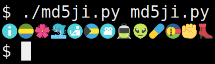

# md5ji

##### md5 checksums with emoji

Do all md5 checksums look the same to you? Do you wish they could be more memorable?




### Requirements

* Python 3
* A terminal emulator with emoji support


### Usage
```
$ md5ji.py filename
```
That's it!


### Thanks to:

* [Emoji Data](https://github.com/iamcal/emoji-data)
